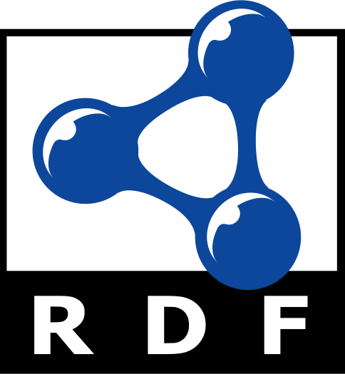

# sparql-quickstarts
SPARQL (SPARQL Protocol and RDF Query Language) Quickstarts

## Resources
- http://www.learningsparql.com/
- https://triply.cc/ - *Triply offers software products & services that enable you to integrate your organizations' data assets into a standards-compliant Knowledge Graph.*
    - https://yasgui.triply.cc/
    - https://github.com/TriplyDB/Yasgui
    - https://github.com/TriplyDB - *Repository used for projects developed and maintained by Triply*
- http://biohackathon.org/d3sparql/ - *JavaScript natually fits for querying a [SPARQL endpoint](http://sparqles.okfn.org/) which provides a REST service returning the result in the JSON format. The [d3sparql.js](http://biohackathon.org/d3sparql/d3sparql.js) library provides functions executing a SPARQL query by [Ajax](http://en.wikipedia.org/wiki/Ajax_(programming)) call (XMLHttpRequest) and visulaizing results by the [D3 library](http://d3js.org/). Basically, this library transforms the [SPARQL Query Results JSON Format](http://www.w3.org/TR/sparql11-results-json/) (aka. application/sparql-results+json) into several JSON formats which major D3 layouts can accept. Many of the examples are borrowed from [bl.ocks.org](http://bl.ocks.org/) and [bost.ocks.org](http://bost.ocks.org/mike/). The d3sparql.js library is distributed under the same license as D3.js's ([BSD license](http://opensource.org/licenses/BSD-3-Clause)).*

