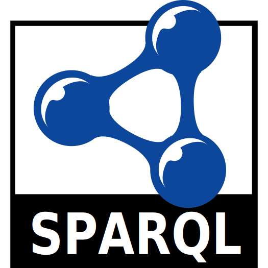

# sparql-quickstarts
SPARQL (SPARQL Protocol and RDF Query Language) Quickstarts

## Resources
- http://www.learningsparql.com/
- https://triply.cc/ - *Triply offers software products & services that enable you to integrate your organizations' data assets into a standards-compliant Knowledge Graph.*
    - https://yasgui.triply.cc/
    - https://github.com/TriplyDB/Yasgui
    - https://github.com/TriplyDB - *Repository used for projects developed and maintained by Triply*
- http://biohackathon.org/d3sparql/ - *JavaScript natually fits for querying a [SPARQL endpoint](http://sparqles.okfn.org/) which provides a REST service returning the result in the JSON format. The [d3sparql.js](http://biohackathon.org/d3sparql/d3sparql.js) library provides functions executing a SPARQL query by [Ajax](http://en.wikipedia.org/wiki/Ajax_(programming)) call (XMLHttpRequest) and visulaizing results by the [D3 library](http://d3js.org/). Basically, this library transforms the [SPARQL Query Results JSON Format](http://www.w3.org/TR/sparql11-results-json/) (aka. application/sparql-results+json) into several JSON formats which major D3 layouts can accept. Many of the examples are borrowed from [bl.ocks.org](http://bl.ocks.org/) and [bost.ocks.org](http://bost.ocks.org/mike/). The d3sparql.js library is distributed under the same license as D3.js's ([BSD license](http://opensource.org/licenses/BSD-3-Clause)).*
    - https://www.slideshare.net/ToshiakiKatayama/d3sparqljs-demo-at-swat4ls-2014-in-berlin
    - https://github.com/ktym/d3sparql or https://github.com/jnbdz/d3sparql
- [SPARQL Explorer for https://dbpedia.org/sparql](https://dbpedia.org/snorql/)
- https://github.com/oxigraph/oxigraph - *SPARQL graph database*
- https://github.com/tarql/tarql - *SPARQL for Tables: Turn CSV into RDF using SPARQL syntax*
    - http://tarql.github.io/ - *SPARQL for Tables: Turn CSV into RDF using SPARQL syntax*
- https://jena.apache.org/ - *A free and open source Java framework for building [Semantic Web](https://www.w3.org/standards/semanticweb/) and [Linked Data](https://www.w3.org/standards/semanticweb/data) applications.*
    - https://jena.apache.org/documentation/query/manipulating_sparql_using_arq.html - Tutorial - Manipulating SPARQL using ARQ - *When you’ve been working with SPARQL you quickly find that static queries are restrictive. Maybe you want to vary a value, perhaps add a filter, alter the limit, etc etc. Being an impatient sort you dive in to the query string, and it works. But what about little Bobby Tables? And, even if you sanitise your inputs, string manipulation is a fraught process and syntax errors await you. Although it might seem harder than string munging, the ARQ API is your friend in the long run.*
    - https://github.com/apache/jena - *Apache Jena*
- https://github.com/neo4j-contrib/sparql-plugin
- https://github.com/knakk/sparql - *SPARQL utilities for Go*
- https://github.com/oxigraph/oxigraph - *SPARQL graph database (Rust)*
- https://cygri.github.io/rdf-logos/ - Logos
- [Simple Knowledge Organization System](https://en.wikipedia.org/wiki/Simple_Knowledge_Organization_System) - *Simple Knowledge Organization System (SKOS) is a W3C recommendation designed for representation of thesauri, classification schemes, taxonomies, subject-heading systems, or any other type of structured controlled vocabulary. SKOS is part of the Semantic Web family of standards built upon RDF and RDFS, and its main objective is to enable easy publication and use of such vocabularies as linked data.*
